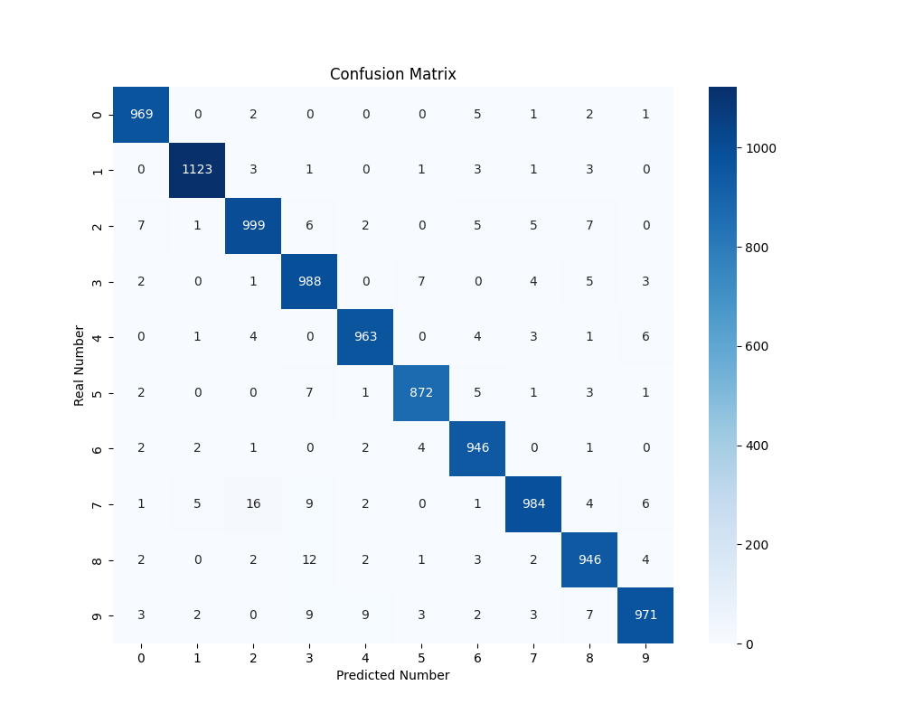

# MNIST Classifier

## Overview

This project implements a neural network-based classifier to recognize handwritten digits from the MNIST dataset. The training process is conducted using three optimization algorithms:

- **SGD**: Standard stochastic gradient descent.
- **SGD + Momentum**: SGD with momentum to accelerate convergence.
- **ADAM**: Adaptive moment estimation for fast and efficient optimization.

The goal is to train the classifier to achieve a test accuracy of **97% or higher** while comparing the performance of the three optimizers.

<div align="center">
  
</div>


## Task

The task involves creating a neural network for digit classification using the MNIST dataset. The following steps are implemented:

- **Dataset Preprocessing**:
  - Load the MNIST dataset and split it into training and testing sets.
  - Normalize pixel values to the range [-1, 1] for efficient training.

- **Model Design**:
  - A feedforward neural network with three fully connected layers.
  - Activation functions and configurations set for efficient learning.

- **Training**:
  - Train the model using **SGD**, **SGD + Momentum**, and **ADAM**.
  - Record training/test losses and accuracy for each optimizer.

- **Evaluation**:
  - Compare performance metrics and confusion matrices for all optimizers.
  - Analyze the training speed, stability, and accuracy of each method.

## How to Run

1. **Clone the Repository**:

```bash
git clone https://github.com/admtrv/MnistClassifier.git
```

2. **Run the Main Script**:

Execute the script to train and evaluate the classifier:
```bash
python classifier.py
```

3. **Adjust Parameters**:

Modify `config.py` to adjust settings like batch size, learning rate, and number of epochs.


## Dependencies

This project uses the following Python libraries:

- `torch` for defining and training the neural network.
- `torchvision` for loading and preprocessing the MNIST dataset.
- `matplotlib` and `seaborn` for visualization.
- `scikit-learn` for confusion matrix computation.

Install dependencies with:
```bash
pip install torch torchvision matplotlib seaborn scikit-learn
```

---

## Documentation

Detailed documentation and explanations are available in the `doc/` directory.
